```
   ██████╗██╗      █████╗ ██╗   ██╗██████╗ ███████╗   ███╗   ███╗██████╗ 
  ██╔════╝██║     ██╔══██╗██║   ██║██╔══██╗██╔════╝   ████╗ ████║██╔══██╗
  ██║     ██║     ███████║██║   ██║██║  ██║█████╗     ██╔████╔██║██║  ██║
  ██║     ██║     ██╔══██║██║   ██║██║  ██║██╔══╝     ██║╚██╔╝██║██║  ██║
  ╚██████╗███████╗██║  ██║╚██████╔╝██████╔╝███████╗██╗██║ ╚═╝ ██║██████╔╝
   ╚═════╝╚══════╝╚═╝  ╚═╝ ╚═════╝ ╚═════╝ ╚══════╝╚═╝╚═╝     ╚═╝╚═════╝ 
```

# `> PERFIL_GITHUB.INIT()`

## `// DIRECTRICES_ESTETICAS`

### `$ cat /sys/design/identity.json`

```json
{
  "developer": {
    "name": "David Mendoza",
    "alias": "@MendozaDavidprogam",
    "location": "Barquisimeto, Venezuela",
    "role": "Full Stack Developer",
    "status": "Estudiante de Análisis de Sistemas",
    "portfolio": "https://portafolio-indol-eight.vercel.app"
  },
  "aesthetic": {
    "theme": "cyberpunk/hacker",
    "influence": ["terminal-ui", "matrix", "neon-noir", "digital-glitch"],
    "mood": "tech-noir con energía underground"
  }
}
```

---

## `// SISTEMA_DE_DISEÑO`

### `█ PALETA_DE_COLORES`

```css
/* Core Palette — Cyberpunk Neon */
--matrix-green:    #00ffcc;  /* Acento primario: cian brillante */
--neon-cyan:       #00ff9d;  /* Acento secundario: verde neón */
--blood-red:       #C8001A;  /* Alerta/crítico: rojo sangre */
--void-black:      #06080a;  /* Fondo base: vacío profundo */
--terminal-white:  #f8fafc;  /* Texto primario: blanco terminal */
--ghost-gray:      #c8d8e0;  /* Texto secundario: gris fantasma */
--shadow-slate:    #3a5060;  /* Texto terciario: sombra */
--grid-line:       #0d1117;  /* Líneas de grid: casi invisible */
```

### `█ TIPOGRAFÍA`

```yaml
Code Headers:
  font: "JetBrains Mono, Fira Code, Cascadia Code, monospace"
  weight: 700
  style: "Fixed-width con ligaduras opcionales"
  usage: "Títulos de secciones, comandos, código inline"

Body Text:
  font: "Inter, -apple-system, sans-serif"
  weight: 400-600
  line-height: 1.6
  usage: "Descripciones, párrafos largos"

Accent Display:
  font: "Orbitron, Rajdhani, monospace"
  weight: 900
  style: "Futurista, geométrica"
  usage: "ASCII art headers, títulos hero"
```

### `█ EFECTOS_VISUALES`

```scss
// Glitch Text Effect
.glitch {
  animation: glitch 1s infinite;
  text-shadow: 
    2px 0 #00ffcc,
    -2px 0 #C8001A;
}

// Neon Glow
.neon-glow {
  text-shadow: 
    0 0 10px #00ffcc,
    0 0 20px #00ffcc,
    0 0 30px #00ffcc,
    0 0 40px #00ff9d;
}

// Scanline Overlay
.scanline::before {
  background: linear-gradient(
    transparent 50%,
    rgba(0, 255, 204, 0.03) 50%
  );
  background-size: 100% 4px;
  animation: scan 8s linear infinite;
}

// Terminal Cursor
.cursor::after {
  content: "▋";
  color: #00ffcc;
  animation: blink 1s step-end infinite;
}
```

---

## `// ASSETS_INTEGRADOS`

### `█ ESTRUCTURA_DE_ARCHIVOS`

```bash
assets/
├── dark.svg      # Banner animado tema oscuro (860KB)
│   └── Features: Retrato dithering + morph React/Node/`</>`
├── light.svg     # Banner animado tema claro (1.4MB)
│   └── Features: Fondo fotográfico preservado
├── stack.svg     # Inventario visual de tecnologías
│   └── Style: Grid de íconos con efectos neón
└── quests.svg    # Registro de misiones/proyectos
    └── Style: Timeline cyberpunk con progreso
```

### `█ DIRECTRICES_DE_USO`

#### **1. Banner Principal (dark.svg / light.svg)**

```markdown
<!-- Implementación con soporte de temas -->
<picture>
  <source 
    media="(prefers-color-scheme: dark)" 
    srcset="./assets/dark.svg">
  <source 
    media="(prefers-color-scheme: light)" 
    srcset="./assets/light.svg">
  
</picture>
```

**Contexto de uso:**
- Header principal del README.md
- Animación continua (morph entre logos)
- Dithering artístico en retrato
- Paleta integrada con #00ffcc como acento

#### **2. Tech Stack (stack.svg)**

```markdown
<!-- Inventario de tecnologías -->
<div align="center">
  
</div>
```

**Contexto de uso:**
- Después de las estadísticas de GitHub
- Grid organizado de tecnologías dominadas
- Efectos de glow en íconos hover (si es interactivo)
- Título estilo terminal: `█ TECH_STACK.inventory()`

#### **3. Registro de Misiones (quests.svg)**

```markdown
<!-- Timeline de proyectos -->
<div align="center">
  
</div>
```

**Contexto de uso:**
- Sección de proyectos destacados
- Timeline visual con barras de progreso
- Estética RPG/cyberpunk
- Título estilo log: `[QUEST_LOG] Proyectos activos`

---

## `// COMPONENTES_DE_INTERFAZ`

### `█ SECCIÓN_HERO`

```markdown
<div align="center">

# `> execute: INIT_PROFILE.sh`

```ascii
╔═══════════════════════════════════════════════════════╗
║  DAVID MENDOZA                                        ║
║  ━━━━━━━━━━━━━━━━━━━━━━━━━━━━━━━━━━━━━━━━━━━━━━━━━  ║
║  [ROLE] Full Stack Developer                          ║
║  [STATUS] Estudiante de Análisis de Sistemas          ║
║  [LOCATION] Barquisimeto, Venezuela                   ║
║  [UPTIME] Desarrollando desde 20XX                    ║
╚═══════════════════════════════════════════════════════╝
```

**[ACCESS_PORTFOLIO]** → https://portafolio-indol-eight.vercel.app

</div>
```

### `█ HEADERS_DE_SECCIÓN`

```markdown
## `// ESTADÍSTICAS_DEL_SISTEMA`
## `// TECH_STACK_INVENTORY`
## `// QUEST_LOG_ACTIVO`
## `// CONTRIBUCIONES_MATRIX`
## `// CANALES_DE_COMUNICACIÓN`
```

**Reglas:**
- Siempre en formato código inline con backticks
- Usar `//` para comentarios estilo C/JS
- Snake_case en mayúsculas para nombres técnicos
- Símbolos ASCII permitidos: `█ ▓ ▒ ░ ═ ║ ╔ ╗ ╚ ╝`

### `█ STATS_CARDS`

```markdown
<!-- Streak Stats con paleta cyberpunk -->


<!-- GitHub Stats con acentos cian -->

```

**Paleta aplicada:**
- `background`: #06080a (void-black)
- `title_color` / `ring` / `stroke`: #00ffcc (matrix-green)
- `fire` / alerta: #C8001A (blood-red)
- `text_color`: #c8d8e0 (ghost-gray)

### `█ SNAKE_DE_CONTRIBUCIONES`

```markdown
<picture>
  <source 
    media="(prefers-color-scheme: dark)" 
    srcset="https://raw.githubusercontent.com/MendozaDavidprogam/MendozaDavidprogam/output/github-snake-dark.svg">
  <source 
    media="(prefers-color-scheme: light)" 
    srcset="https://raw.githubusercontent.com/MendozaDavidprogam/MendozaDavidprogam/output/github-snake.svg">
  
</picture>
```

**Configuración del workflow (snake.yml):**
```yaml
color_snake: 00ffcc  # Matrix green para el snake
color_dots: 
  dark: "#2d3343,#4b5563,#00ffcc,#00ff9d,#C8001A"
  light: "#ebedf0,#d9a5ab,#c25e6b,#00ffcc,#00ff9d"
```

---

## `// BADGES_Y_CONTACTO`

### `█ DISEÑO_DE_BADGES`

```markdown
[](https://github.com/MendozaDavidprogam)

[](https://portafolio-indol-eight.vercel.app)

[](mailto:mendozadavidprogramacion2.0@gmail.com)


```

**Paleta aplicada:**
- GitHub: #00ffcc (matrix-green)
- Portfolio: #00ff9d (neon-cyan)
- Email: #C8001A (blood-red para urgencia)
- Background: #06080a (void-black)

---

## `// WORKFLOWS_AUTOMATIZADOS`

### `█ SNAKE_ANIMATION_GENERATOR`

**Archivo:** `.github/workflows/snake.yml`

```yaml
name: Generate Snake Animation

on:
  schedule:
    - cron: "0 */12 * * *"  # Cada 12 horas
  workflow_dispatch:
  push:
    branches: [main]

jobs:
  generate:
    permissions:
      contents: write
    runs-on: ubuntu-latest
    timeout-minutes: 10
    steps:
      - name: Generate snake SVGs
        uses: Platane/snk/svg-only@v3
        with:
          github_user_name: ${{ github.repository_owner }}
          outputs: |
            dist/github-snake.svg?palette=githublight&color_snake=00ffcc&color_dots=#ebedf0,#d9a5ab,#c25e6b,#00ffcc,#00ff9d
            dist/github-snake-dark.svg?palette=githubdark&color_snake=00ffcc&color_dots=#2d3343,#4b5563,#00ffcc,#00ff9d,#C8001A
      
      - name: Push to output branch
        uses: crazy-max/ghaction-github-pages@v3.1.0
        with:
          target_branch: output
          build_dir: dist
          commit_message: "[AUTO] Snake matrix updated"
        env:
          GITHUB_TOKEN: ${{ secrets.GITHUB_TOKEN }}
```

**Notas técnicas:**
- Snake color: #00ffcc (matrix-green) en vez del rojo original
- Dots progression: grises → cian → verde → rojo (gradiente de actividad)
- Commit message con prefijo `[AUTO]` estilo log

---

## `// GUÍA_DE_MANTENIMIENTO`

### `█ CACHE_BUSTING`

```bash
# Forzar recarga de assets desde CDN
https://raw.githubusercontent.com/MendozaDavidprogam/MendozaDavidprogam/main/assets/dark.svg?v=$(date +%s)
```

### `█ CHECKLIST_PRE_COMMIT`

```yaml
- [ ] Paleta de colores consistente (#00ffcc, #00ff9d, #C8001A)
- [ ] Headers con formato `// NOMBRE_SECCION`
- [ ] ASCII art sin caracteres rotos
- [ ] Alt text descriptivo en todas las imágenes
- [ ] Links funcionando (portfolio, email, GitHub)
- [ ] SVGs cargando correctamente en ambos temas
- [ ] Snake animation ejecutándose (check Actions tab)
- [ ] Stats cards con Vercel instance actualizada
```

### `█ TROUBLESHOOTING`

| Problema | Causa | Solución |
|----------|-------|----------|
| SVG no actualiza | Caché CDN | Agregar `?v=timestamp` al final de la URL |
| Snake no aparece | Action no corrió | Revisar permisos en Settings → Actions |
| Stats "rate limit" | Sin self-hosting | Fork + deploy en Vercel con PAT |
| ASCII art roto | Encoding incorrecto | Usar UTF-8, evitar emojis mezclados |

---

## `// DEPENDENCIAS_EXTERNAS`

```json
{
  "stats": {
    "github-readme-stats": "github.com/anuraghazra/github-readme-stats",
    "streak-stats": "streak-stats.demolab.com",
    "deployment": "Vercel (self-hosted con PAT_1)"
  },
  "animations": {
    "snake-generator": "Platane/snk@v3",
    "output": "Branch 'output' vía GitHub Pages"
  },
  "badges": {
    "shields.io": "img.shields.io",
    "profile-views": "komarev/ghpvc"
  }
}
```

---

## `// INFORMACIÓN_DE_CONTACTO`

```ini
[DEVELOPER]
name = David Mendoza
username = @MendozaDavidprogam
email = mendozadavidprogramacion2.0@gmail.com
portfolio = https://portafolio-indol-eight.vercel.app
location = Barquisimeto, Venezuela
timezone = UTC-4 (VET)

[EDUCATION]
degree = Análisis de Sistemas
status = En curso
specialization = Full Stack Development

[NETWORKS]
github = github.com/MendozaDavidprogam
linkedin = (no configurado actualmente)
facebook = (no aplica)
```

---

```
> PROFILE_LOADED_SUCCESSFULLY
> AESTHETIC: CYBERPUNK_MODE [ENABLED]
> ACCENT_COLOR: #00ffcc [MATRIX_GREEN]
> STATUS: READY_FOR_COMMIT █▓▒░
```
