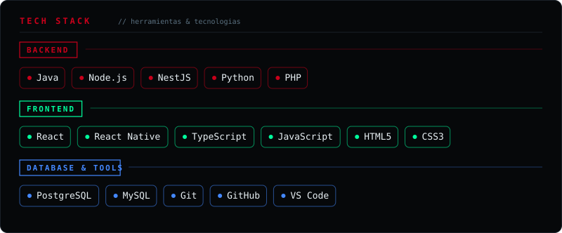
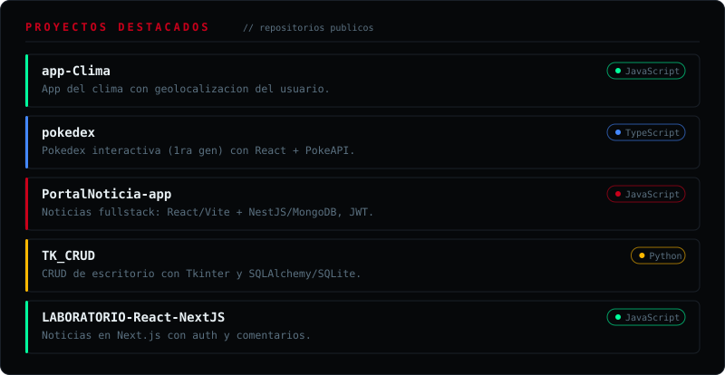

<div align="center">

# David Mendoza
### Full-Stack Developer & Systems Analyst

<picture>
  <source media="(prefers-color-scheme: dark)" srcset="https://raw.githubusercontent.com/MendozaDavidprogam/MendozaDavidprogam/main/assets/dark.svg">
  <source media="(prefers-color-scheme: light)" srcset="https://raw.githubusercontent.com/MendozaDavidprogam/MendozaDavidprogam/main/assets/light.svg">
  
</picture>

<br/>

```javascript
const developer = {
  name: "David Mendoza",
  location: "Barquisimeto, Venezuela 🇻🇪",
  role: "Full-Stack Developer",
  education: "Systems Analysis (In Progress)",
  portfolio: "https://portafolio-indol-eight.vercel.app",
  focus: ["Web Development", "System Design", "Problem Solving"],
  currentlyLearning: ["Advanced React Patterns", "Cloud Architecture"]
};
```

</div>

<br/>

## 🎯 About Me

Passionate full-stack developer from Barquisimeto, Venezuela, specializing in building modern web applications and system solutions. Currently pursuing Systems Analysis while actively developing real-world projects.

🔗 **[View My Portfolio](https://portafolio-indol-eight.vercel.app)**

<br/>

## 📊 GitHub Activity

<div align="center">


</div>

<br/>

<div align="center">
<table>
<tr>
<td width="50%">


</td>
<td width="50%">


</td>
</tr>
</table>
</div>

<br/>

## 🛠️ Tech Stack

<div align="center">



</div>

<br/>

## 🚀 Projects & Contributions

<div align="center">



</div>

<br/>

## 📈 Contribution Graph

<div align="center">

<picture>
  <source media="(prefers-color-scheme: dark)" srcset="https://raw.githubusercontent.com/MendozaDavidprogam/MendozaDavidprogam/output/github-snake-dark.svg" />
  <source media="(prefers-color-scheme: light)" srcset="https://raw.githubusercontent.com/MendozaDavidprogam/MendozaDavidprogam/output/github-snake.svg" />
  
</picture>

</div>

<br/>

## 💼 Let's Connect

<div align="center">

<a href="https://github.com/MendozaDavidprogam">
  
</a>
&nbsp;&nbsp;
<a href="https://portafolio-indol-eight.vercel.app">
  
</a>
&nbsp;&nbsp;
<a href="mailto:mendozadavidprogramacion2.0@gmail.com">
  
</a>

<br/><br/>


</div>

<br/>

---

<div align="center">

*"Building the future, one commit at a time"* 💻✨

</div>
