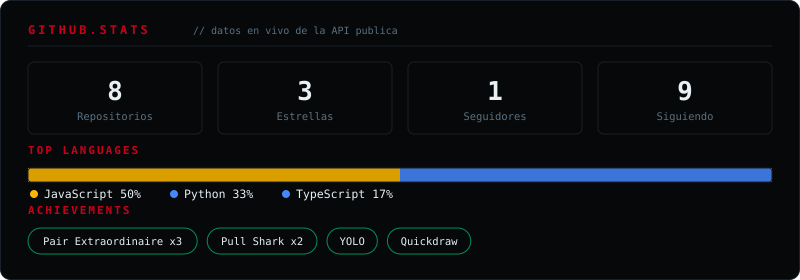

<!-- ═══════════════════════════════════════════════════════
     DAVID MENDOZA — README.md
     github.com/MendozaDavidprogam
     assets/dark.gif · assets/light.gif (banner animado)
     assets/stack.svg · assets/quests.svg · assets/stats.svg
     ═══════════════════════════════════════════════════════ -->

<picture>
  <source media="(prefers-color-scheme: dark)" srcset="https://raw.githubusercontent.com/MendozaDavidprogam/MendozaDavidprogam/main/assets/dark.gif">
  <source media="(prefers-color-scheme: light)" srcset="https://raw.githubusercontent.com/MendozaDavidprogam/MendozaDavidprogam/main/assets/light.gif">
  
</picture>

 

## `// SOBRE MÍ`

Desarrollador full-stack de **Barquisimeto, Venezuela**, enfocado en construir aplicaciones web modernas y soluciones de sistemas. Actualmente estudiando **Análisis de Sistemas** mientras desarrollo proyectos reales.

🔗 **[Ver mi Portafolio](https://portafolio-indol-eight.vercel.app)**

 

## `// ESTADÍSTICAS DEL SISTEMA`

 

Si esta tarjeta de racha no carga, es un servicio público externo con límite de peticiones — la tarjeta de arriba (`stats.svg`) es autosuficiente y no depende de nadie.

  

## `// TECH STACK`

 

## `// PROYECTOS DESTACADOS`

 

## `// CONTRIBUTION GRAPH`

<picture>
  <source media="(prefers-color-scheme: dark)" srcset="https://raw.githubusercontent.com/MendozaDavidprogam/MendozaDavidprogam/output/github-snake-dark.svg" />
  <source media="(prefers-color-scheme: light)" srcset="https://raw.githubusercontent.com/MendozaDavidprogam/MendozaDavidprogam/output/github-snake.svg" />
  
</picture>

 

## `// CONECTAR`

&nbsp;

  

 

---

*"Building the future, one commit at a time"* 💻✨

